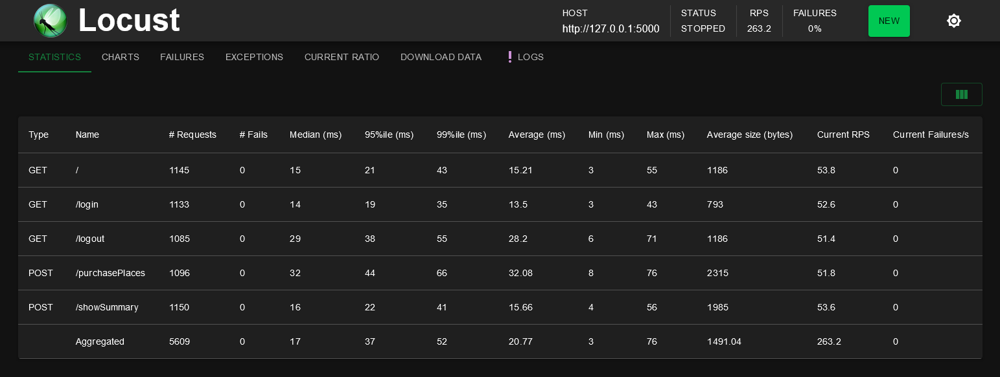

# GUDLFT Réservations


[](https://pytest.org)
[](https://coverage.readthedocs.io/en/latest/)
[](https://locust.io/)

[](https://www.python.org/dev/peps/pep-0008/)
[](https://flake8.pycqa.org/en/latest/)
[](https://github.com/psf/black)


Güdlft a commencé par organiser des compétitions pour les clubs locaux, a gagné en popularité et accueille désormais exclusivement des compétitions pour les entreprises de vêtements de fitness de marque.

Güdlft a mis sur pied une équipe appelée Regional Outreach chargée de créer une version plus légère (et moins coûteuse) de leur plateforme actuelle pour les organisateurs régionaux. L'objectif de l'application est de rationaliser la gestion des compétitions entre les clubs (hébergement, inscriptions, frais et administration). L'équipe a dressé une liste de spécifications fonctionnelles pour un prototype, réparties en plusieurs phases.

Création d'un MVP (minimum viable product) à déboguer et à tester.

L'application est alimentée par des fichiers [JSON](https://www.tutorialspoint.com/json/json_quick_guide.htm) dans le dossier data. Cela permet d'éviter d'avoir une base de données jusqu'à ce que nous en ayons réellement besoin. Les principaux sont :

* **competitions.json** - liste des compétitions
* **clubs.json** - liste des clubs. Vous pouvez y consulter les adresses électroniques acceptées par l'application pour se connecter.

## Documents du Projet


1. __[Spécifications fonctionnelles](docs/Spécifications+fonctionnelles.pdf)__
    * Les phases du projet.
    * Le guide de développement.

    
2. __[Repo GitHub d'origine](https://github.com/OpenClassrooms-Student-Center/Python_Testing)__
    * Projet initial.
    * Issues à deboguer.
    * Fonctionnalité à ajouter.

    


## Installation et activation de l'environnement Virtuel et des dépendances
Création de l'environnement virtuel : 
```bash
python -m venv env
```
Activation de l'environnement virtuel se placer dans le dossier **env/scripts** et taper : 
```bash
./activate
```
Installation des dependances necessaires au projet avec poetry : 
```bash
pip install poetry
poetry install

```
## Usage


Exécuter la commande suivante dans le dossier racine pour lancer le serveur de développement :

```bash
flask run
```
Le serveur de développement démarre à l'adresse http://127.0.0.1:5000/ affichant la page d'accueil.

* **Index page :** page d'accueil permettant de voir la liste des clubs avec leurs points, appuyer sur le bouton <u>Sign in</u> pour arriver sur la page login.


* **Login page :** Entrer l'email du club pour se connecter, appuyer sur le bouton <u>Return Home</u> pour revenir sur la page d'index.


* **Summary page :** Affiche les informations du club connecté et la liste des compétitions, appuyer sur le bouton <u>Book Places</u> d'une compétition pour réserver des places ou sur le bouton <u>Logout</u> pour se déconnecter.


* **Purchase page :** Affiche la compétition et le club avec les points et places disponibles, remplisser le formulaire avec le nombre de places voulues ou appuyer sur le bouton <u>Return Summary</u> pour revenir sue la page summary.


## Tests

Les tests de l'application ont été effectués avec le framework `pytest`, la couverture des tests avec `coverage` et les tests de performances avec `locust`.

**Pour lancer les tests avec la couverture `coverage` :**

```bash
pytest --cov
```


**Pour effectuer un rapport html de pytest :**

```bash
pytest --html=report.html
```


**Pour effectuer un rapport html de couverture de tests avec coverage :**

```bash
pytest --cov --cov-report html
```


**Pour lancer un test de performances locust :**
```bash
locust
```
Le serveur de développement démarre à l'adresse http://localhost:8089

Les valeurs de configuration sont dans `pyproject.toml`

```bash
[tool.locust]
locustfile = "gudlift_reservation/tests/performance_tests/locustfile.py"
host = "http://localhost:5000"
users = 6
spawn-rate = 1
```


Appuyer sur le bouton `start` pour démarrer le test.




## Contribuer

Si vous souhaitez contribuer à ce projet, veuillez suivre ces étapes :

    Ouvrez un problème pour discuter de ce que vous souhaitez changer.
    Fork ce dépôt et créez une branche pour votre contribution.
    Soumettez une demande d'extraction avec vos modifications.
